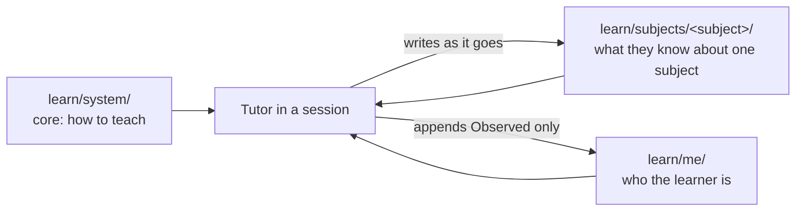

# The learning system — how it fits together

This vault is a reusable one-to-one tutor. The idea comes from Eero Alvar's "How I Learn with AI": encode a teaching philosophy into an agent, keep the learner's cognitive effort on the material and off the logistics, and make the agent's reasoning inspectable. This version adds what that setup lacked: learning state that survives between sessions as plain Markdown, so a fresh AI session continues where the last one stopped without re-reading a transcript.

## Three layers, three reasons to edit

**`learn/system/`** is the teaching philosophy, the workflow, the record schema, and the diagram rules. It never names a subject or a person. You edit it when you want the *tutor* to behave differently. **`learn/me/preferences.md`** is you. The *Stated* half is yours to edit; the tutor only appends to *Observed*, with evidence, and proposes changes to *Stated* rather than making them. **`learn/subjects/<slug>/`** is one subject's state: `record.md` (what you know, with evidence), `plan.md` (the lesson graph), `resume.md` (the 200-word hand-off), and `sessions/` (one notebook per session). Starting a new subject creates a new folder and touches nothing else.

## What a session looks like

Open a terminal in the vault and run `claude` or `codex`. Claude Code reads `CLAUDE.md` and its three imports. Codex reads `AGENTS.md`, which directs it to read the same files. Each host's SessionStart hook prints the date and every subject's `resume.md`. The tutor lists your subjects and asks which to resume or start. Codex project hooks require a one-time trust review before they run; until then, Codex reads the records directly as `AGENTS.md` instructs.

Use `/learn-start <slug>` in Claude Code or `$learn-start <slug>` in Codex. It captures the goal as observable success criteria, diagnoses each prerequisite strand by binary search until it has a floor and a ceiling, writes a plan as a node graph, sends the plan to two subagents (`fact-checker` for claims, `plan-reviewer` for pedagogy), shows you the graph, and waits for approval before teaching. The matching resume, check, and end commands use the same `/learn-*` and `$learn-*` forms.

The teach loop runs one node at a time: motivate, establish one reasoning step per message with a check after each, connect, check, and write the node into the session note before moving on. The check skill runs a mixed retrieval quiz every few nodes. At 45 minutes the tutor says so.

The end skill finalizes the session note, updates the record and plan on evidence, rewrites `resume.md`, appends an observation to your preferences only if it met the two-sighting bar, regenerates the dashboard and progress views, then re-reads every file it touched and prints a checklist of what actually changed before the hand-off. The resume skill next time reads those files in order, recaps in eight lines, decay-checks the last nodes, and continues.

Answers go in chat. Obsidian is the notebook: the lesson, diagrams, quiz results, and records appear there as they are written. Claude Code's `log.md` still updates as responses stream and includes its question-picker exchanges. In Codex, open `learn/subjects/<slug>/codex-log.md`; its hook records submitted prompts and completed replies after each turn. Each host keeps its own generated log so one does not overwrite the other. Both write the same `record.md`, `plan.md`, `resume.md`, and session notes. If a Codex hook was not trusted or available, the records still work, but its log and active-time clock will not update automatically.

## Why it is built this way

*Files, not memory features.* Neither host's memory is the source of truth here. Everything that matters is a Markdown record you can read, edit, and version. `CLAUDE.md` and `AGENTS.md` both say that if it is not in the record, it did not happen.

*Evidence, not claims.* A node only changes status when you answered something. The record separates what you enjoyed from what produced correct answers, because those diverge and the tutor should teach from the second.

*Subagents only where they earn it.* `fact-checker` exists because verification is slow and would bloat the teaching context; `plan-reviewer` exists because a reviewer who has not seen the conversation catches what the planner is blind to. There is no diagram subagent: mermaid rules in `diagrams.md` plus a re-read are enough at this scale.

*Permissions as guard rails.* `.claude/settings.json` governs Claude Code. Codex follows its own sandbox and approval settings. Both entrypoint instructions treat `learn/system/` as read-only during lessons and prohibit editing the learner's *Stated* preferences.

## Changing things

To change how the tutor teaches, edit `learn/system/tutor.md`. To change how a phase works, edit `workflow.md`. To change what is recorded, edit `records.md` and the templates. To change how you like to learn, edit the *Stated* section of `learn/me/preferences.md`. To add a subject, use the host's `learn-start` skill. Claude Code configuration remains under `.claude/`; Codex skills are under `.agents/skills/`, custom agents under `.codex/agents/`, and hooks under `.codex/`.

Keep `CLAUDE.md` and `AGENTS.md` concise because both are read at startup.

## Known limits of this version

- Diagnosis uses chat questions and a multiple-choice picker when available.
- The 45-minute mark is measured, not estimated: `obsidian-live.py` records the time of every message you send, separates active working time from time you stepped away (a gap over 15 minutes), and reports both into the tutor's context. The tutor recaps after a long gap and offers the break on active time. It is still a prompt rather than an alarm — nothing stops the session on its own.
- Node-level progress is generated, not queried. Dataview reads only frontmatter and node statuses live in Markdown tables, so `learn-status.py` renders them into `Dashboard.md` and each `progress.md`; `learn/Queries.md` uses Dataview for the subject- and session-level questions, which is what a query language is actually good for. Dataview is a community plugin: if the queries show as code blocks, turn off Restricted Mode in Obsidian's *Community plugins* settings and reload.
- The live conversation saves submitted text, including voice recognition's transcription. It does not record audio or words spoken before submission. Session notes remain curated lesson notes.
- Mermaid renders in Obsidian; if a newer diagram type fails there, the rule is to fall back to `flowchart`.
- Claude Code and Codex have separate skill syntax and hook payloads. Claude Code streams to `log.md`; Codex writes completed turns to `codex-log.md`. The learning records and generated dashboard are shared.
