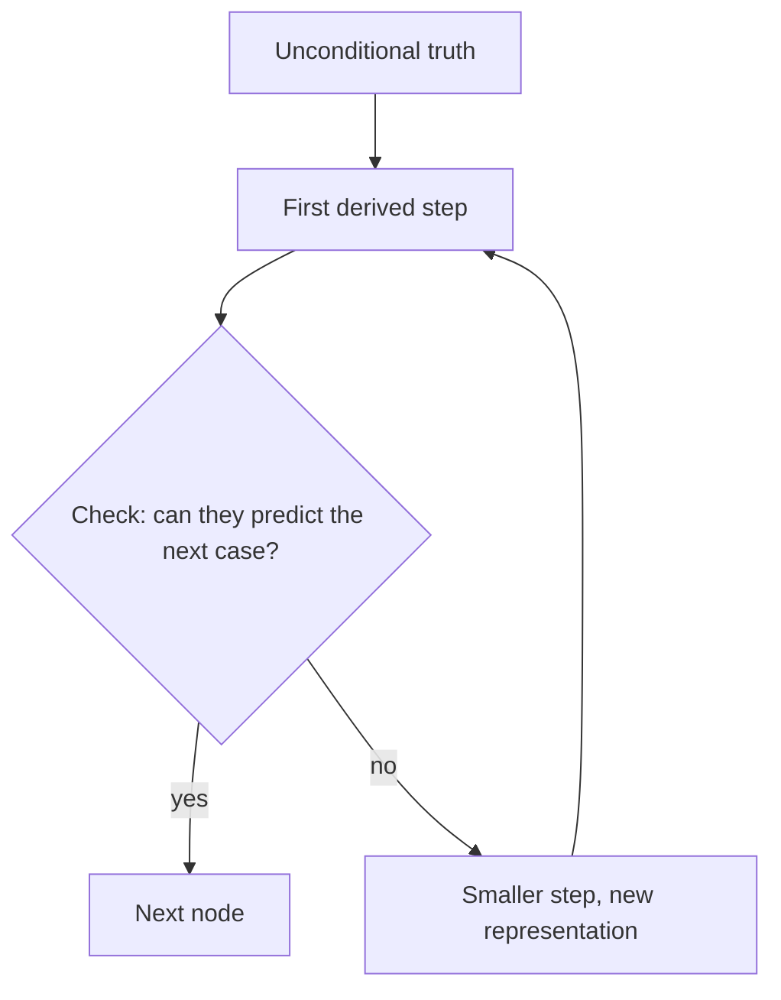

# Diagrams — rules for pictures in lessons and plans

Obsidian renders mermaid blocks and LaTeX natively, so a diagram written into a note is a diagram the learner sees. A diagram earns its place when the *shape* of an idea is the point: a dependency order, a decision, a flow, a two-axis tradeoff. It does not earn its place as decoration. A diagram makes a plan inspectable; it does not make it correct, so it never replaces a check question.

## When to draw which

| The idea is about… | Draw | Mermaid type |
| --- | --- | --- |
| What depends on what (the plan itself, prerequisite chains) | Dependency graph | `flowchart TD` |
| A process or algorithm's steps | Flow chart | `flowchart TD` or `LR` |
| A choice with conditions ("if X then…") | Decision tree | `flowchart TD` with `{diamond}` nodes |
| Two independent tradeoffs | Quadrant chart | `quadrantChart` |
| Objects and their relationships (classes, tables, entities) | Class diagram | `classDiagram` |
| Order of events between parties | Sequence diagram | `sequenceDiagram` |
| A state that changes on events | State diagram | `stateDiagram-v2` |

If a type fails to render in Obsidian (its bundled mermaid can lag the newest release), fall back to `flowchart`, which always renders.

## Rules that keep diagrams rendering

- Fence with three backticks and `mermaid`, nothing else on the fence line.
- Twelve nodes or fewer. If it needs more, it is two diagrams.
- Node ids: letters and digits only (`n1`, `Base`, `Step2`). Put the human text in the label.
- Quote any label containing parentheses, colons, quotes, or `#`: `A["f(x): the input"]`. Unquoted, these characters break the parser.
- Edge labels: `A -- "label" --> B` or `A -->|"label"| B`.
- No `%%{init}` directives, no HTML in labels, no `click` handlers. One level of `subgraph` at most.
- Re-read the block after writing it: balanced brackets and quotes, every id defined before it is styled, arrows pointing the way the reasoning flows.

## Math

Inline math `$x^2$`, display math on its own lines with `$$ … $$`. Obsidian uses MathJax; standard LaTeX commands work, `\text{}` for words inside math.

## Code

Fenced code blocks with a language tag (` ```java `, ` ```python `). Keep example code under 20 lines; a check question about a 40-line example is a reading test, not a concept test.

## A minimal example


