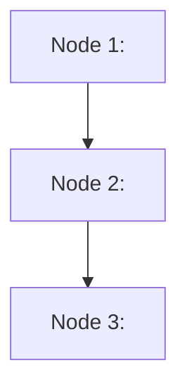

# {{Title}} — lesson plan

## Where the learner starts

*(Two or three lines from the diagnosis: which strands are strong, where the edge is, what is skipped.)*

## Goal and final checks

*(Restate the success criteria from `record.md`; each maps to a final check at the end of the plan.)*

## Dependency graph

## Nodes

*(In teaching order. Each node is one concept, teachable in one sitting of 10–20 minutes. Prereqs reference node ids.)*

| Id | Node | Rests on (unconditional truth) | Discovery question | Check type | Est. min | Prereqs | Status |
| --- | --- | --- | --- | --- | --- | --- | --- |
| n1 |  |  |  |  |  |  | planned |
| n2 |  |  |  |  |  |  | planned |

## Session groups

*(Nodes grouped into 45–60 minute sessions. Re-group at `/learn-end` if pace differs from the estimate.)*

- Session 1: n1, n2
- Session 2: n3, …

## Review notes

*(What `fact-checker` and `plan-reviewer` flagged, and what was changed. Unresolved uncertainty stays listed here until resolved.)*
