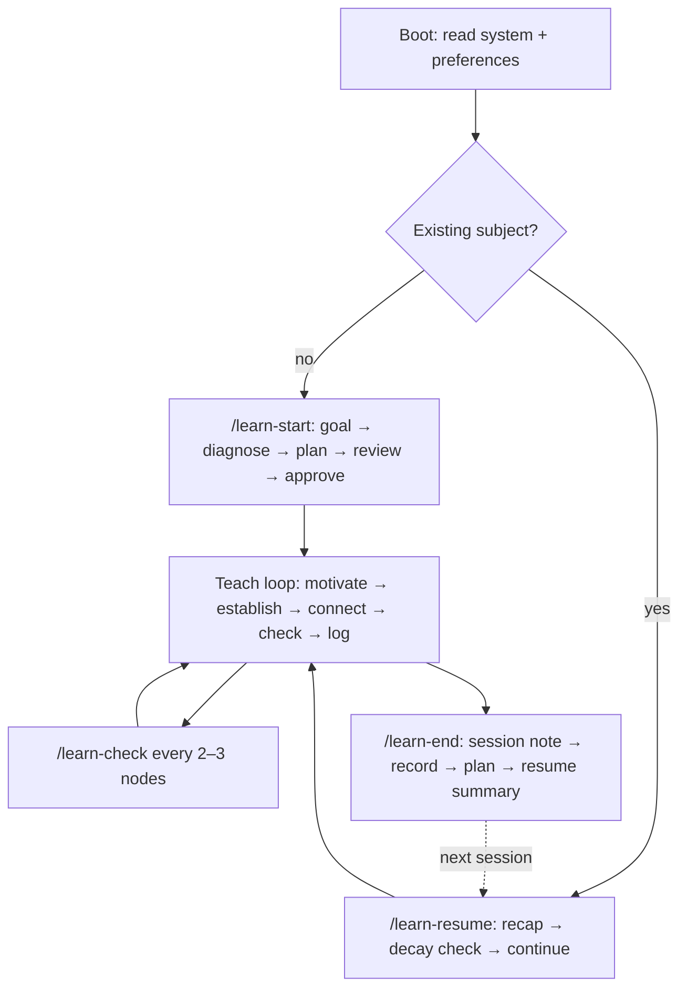

# Workflow — how every learning project runs

Every subject goes through the same phases. The phases are subject-agnostic; the content comes from `learn/subjects/<subject>/` and the learner from `learn/me/preferences.md`. Claude Code invokes the four learning skills as `/learn-*`; Codex invokes them as `$learn-*`. The slash form below names the workflow, and the matching skill defines the file mechanics for each host.

## Phase 0 — Boot (every session)

Claude Code reads `CLAUDE.md`; Codex reads `AGENTS.md`. SessionStart prints a subject index, operational preferences, open-note warnings, and the full resume for this conversation's selected subject when known. Before teaching, read this file and `tutor.md`; after selection, load the selected subject's full state as Phase 5 specifies. Read `learn/me/preferences.md` in full for planning, preference updates, or conflicting guidance. If the hook summary is missing, read its `Operational summary`. Offer the host's `learn-resume` or `learn-start` skill. Do not teach until one is chosen.

## Phase 1 — Start a project (`/learn-start`)

1. **Goal capture.** Ask at most three questions, together, not in rounds: what does *done* look like as something observable; why this, why now; any deadline or context (a course, an interview, curiosity). Turn the answer into 3–6 **success criteria** the learner could be tested on. Write them to `record.md`.
2. **Diagnose.** Identify the 3–6 **strands** the goal depends on (prerequisite threads, e.g. for a math topic: notation, the previous concept, the computational skill; for a programming topic: the language feature, the mental model, the design judgment). For each strand, probe by binary search as `tutor.md` describes. Budget: 10–15 minutes, roughly 12–20 questions total. Every probe result goes into `record.md` as evidence. If the learner's stated prerequisites are already in another subject's record, read that record instead of re-probing.
3. **Plan.** Write `plan.md`: an ordered list of concept **nodes** from each strand's floor to the goal. Each node: what unconditional truth it rests on, its discovery question, the check type, estimated minutes, and its prerequisite nodes. Mark nodes the diagnosis already demonstrated as `skipped`. Draw the dependency graph as a mermaid DAG. Group nodes into sessions of 45–60 minutes.
4. **Review.** Run the `fact-checker` subagent on every factual claim the plan rests on, and the `plan-reviewer` subagent against `record.md` and `preferences.md`. Fix what they flag; record unresolved uncertainty in the plan.
5. **Present and approve.** Show the learner the graph and a five-line summary: what they already have, what the first session covers, what the last node is, how many sessions, what they will be able to do at the end. Wait for approval or edits. The plan is a contract the learner can inspect, not a hidden agenda.
6. Open a session note and enter the teach loop.

## Phase 2 — Teach loop (one node at a time)

For the current node, in order:

1. **Motivate** with the discovery question. One message.
2. **Establish** the concept one reasoning step per message, check question after each non-trivial step. Use a diagram when structure is the point.
3. **Connect** it to earlier nodes and, if it clarifies, to the learner's interests.
4. **Check** with a retrieval or application question. Grade it. Log the question, the answer, and the verdict.
5. **Log** the node to the session note *now*: the explanation as taught, the diagram, the check and result, any misconception candidates. Update the node's status in `record.md` (`planned → introduced → checked`).
6. Every 2–3 nodes, run a mixed retrieval check (`/learn-check`) covering the current node and one earlier one. **This is a gate:** a fourth consecutive new node does not open until a check is logged. If you skip one deliberately, write the reason under *Retrieval checks*. An empty *Retrieval checks* section at `/learn-end` means the rule was broken, and `/learn-end` records that in the note rather than leaving it blank.

Adaptation rules are in `tutor.md` under *Pacing*. If a check reveals a missing prerequisite the diagnosis missed, add a node to the plan, say so, and teach it before continuing.

## Phase 3 — Session mechanics

- Run `date` when a session note is opened and write the start time in it.
- **Active time, not wall-clock time, drives the break.** Each host's `UserPromptSubmit` hook measures the gap since the learner's previous message and splits the session into active and away time, keyed on the open session note. It stays silent on an ordinary turn and speaks on two events only: a gap over 15 minutes, and the 45-minute working-block mark. Claude Code also queues a mark crossed during a question picker until the next typed message. `/learn-end` in Claude Code reads totals with `python3 .claude/hooks/obsidian-live.py clock --subject <slug>`; `$learn-end` in Codex uses `python3 .codex/hooks/learning.py clock --subject <slug>`. A gap over 15 minutes means the learner stepped away: give a two-line recap before asking anything new, and do not count that time toward the 45-minute block. Trust recorded totals over an estimate. If the host's hook did not run, record `unknown`.
- At about 45 minutes, say so and suggest a 5–10 minute break. Before the break, run `/learn-end break` as a checkpoint so nothing is lost; after it, `/learn-resume <subject>` reopens the same session note and skips the decay check, provided the pause is under 6 hours old — past that the note is finalized as a cut-off and a new session starts (`records.md`, *Closing an open note*).
- Never let the transcript be the only place something lives. Every taught node is in the session note before the next node begins.
- Answers come in chat (typed or voice). The session note is the notebook, not the input box. If the learner writes work in the note and says so, read it from there.

## Phase 4 — End a session (`/learn-end`)

In this order:

1. Finalize the **session note**: what was covered, checks and results, misconception candidates, corrections, what worked and what did not, the next step.
2. Update **`record.md`**: node statuses, strand floors and ceilings if they moved, misconceptions (new, or resolved with the evidence), the *what works for this learner in this subject* section.
3. Update **`plan.md`**: node statuses, re-sequencing if the diagnosis changed, next session's node group.
4. Rewrite **`resume.md`** from scratch. Under 200 words. It is the first thing the next session reads.
5. **`preferences.md` — only at the stated bar.** An observation joins *Observed* only once it has appeared in at least two checks or the learner has confirmed it directly. One sighting is not enough, however clear it looked, and the two sightings need not fall in the same session: a first sighting is written to *Preference candidates* in the session note and carried into the *Candidates* tally in `preferences.md`, where a later session can count it. If nothing met the bar this session, say so in one line in chat — "no preference observation met the two-sighting bar" — and write nothing to *Observed*. Never edit *Stated*; contradictions go under *Proposed changes to Stated*.
6. Regenerate the status views: `python3 .claude/hooks/learn-status.py`. Both hosts use this generator. It rewrites `learn/Dashboard.md` and each subject's `progress.md` from the records, so they cannot drift from `record.md`.
7. **Verify, do not assume.** Re-read every file steps 1–6 were supposed to touch and prepare a checklist: file, changed or unchanged, and one phrase on what changed. A step that was skipped, blocked by a permission prompt, or not applicable is reported as such. Never narrate a write that did not happen. A record the learner believes exists and does not is worse than no record.
8. **Close once.** After all writes and verification are finished, send one closing block containing the checklist, the preference-bar result, the resume summary exactly once, and one next-step line. For a break, that line says how to resume. Host-required progress updates may appear before this block, but they must not contain a provisional checklist, session summary, or handoff. After sending the closing block, stop; do not restate or paraphrase it.

## Phase 5 — Resume (`/learn-resume`)

1. Read, in order: `resume.md`, `record.md`, `plan.md`, the most recent session note. Read them in full; do not skim.
2. Give a recap of at most eight lines: where we are in the plan, what is solid, what is shaky, what the open misconceptions are, what today covers.
3. Run a **decay check**: one retrieval question on each of the last 1–2 checked nodes before teaching anything new. Pass moves the node to `solid`; fail marks it `decayed`, and you re-establish it briefly before continuing.
4. Open a new session note and continue the teach loop from the plan.

## Reviewing across subjects (`/learn-review`)

The five phases above all run inside one subject, and that is the gap `/learn-review` fills. `checked → solid` requires a retrieval check in a *later* session, which only Phase 5 performs, and only for the subject being resumed. A subject marked `done` is never resumed, so its `checked` nodes are stranded there permanently.

A review is not one of the phases. It opens no session note, teaches nothing, and belongs to no subject:

1. **Pick in code.** `python3 .claude/hooks/learn-status.py --due` ranks every node in the vault by time since its last check, capped per subject. Read-only, offline, and the same picker `/learn-check` uses for its older spacing node.
2. **Ask and grade** by `tutor.md`, *Checks and quizzes*. Every question is retrieval, and every question names its subject first — the learner has had no recap.
3. **Log the split**, per `records.md`, *Reviews*: the narrative to `learn/reviews/YYYY-MM-DD-rNN.md`, the evidence and status moves to each subject's `record.md`, and nothing else in any subject.

A node that fails a review is `decayed`, which is the signal to run `/learn-resume` on that subject. A review never re-teaches it.

## Changing subject

Run `/learn-start <new-subject>`. Nothing in `learn/system/` or `learn/me/` changes. If the new subject shares prerequisites with an existing one, read that subject's record during diagnosis instead of re-probing.
